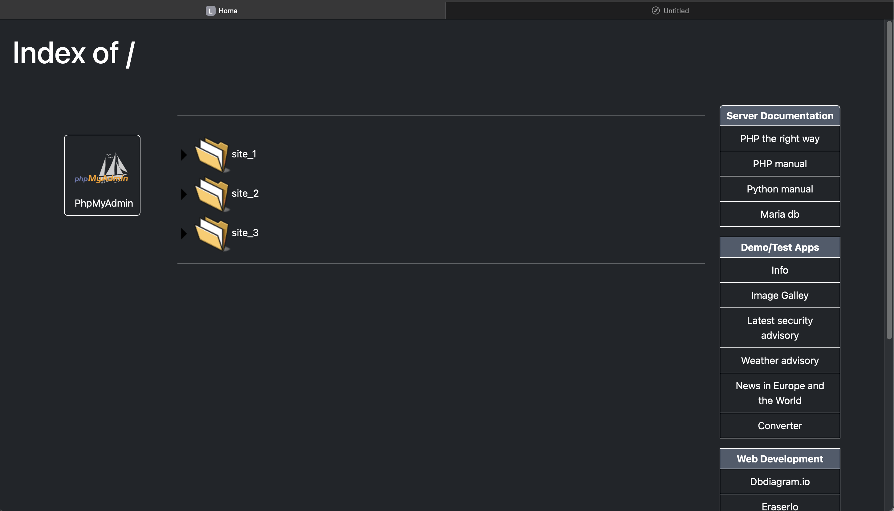
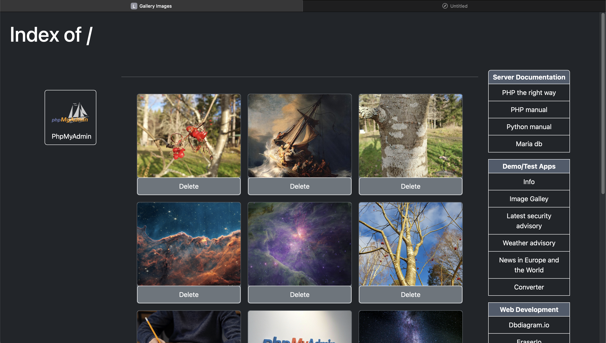
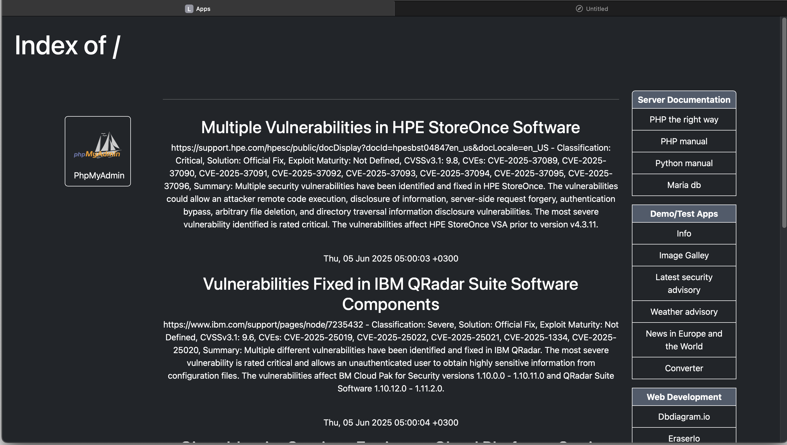

# Simple PHP Web Foundation for Docker-based Projects

This is a lightweight Docker setup designed to host and organize multiple PHP-based web projects.

I made this container to group and manage my many unfinished or experimental PHP projects in a more meaningful way. I often use it when I need to do something in PHP.

> **Note:** This is a personal project and is not intended for production use out of the box. However, with a few adjustments such as enhanced security and a better UI can be adapted for production environments.
> I’ve shared this repository in the hope that it may be useful to others, but please note that I maintain it in my spare time and may not always be able to respond or implement improvements quickly. Thanks for your patience!

### 🌱 Who is it for?

- Developers looking for a quick way to spin up and manage PHP projects using Docker.
- Beginners learning PHP, as it includes clean project structure with **Twig** for templating, which helps separate logic from the frontend.

This container allows you to:

- Easily run multiple PHP projects under one setup.
- Organize your sites inside a `/sites/` directory which are automatically listed in the frontpage if there's a folder inside.
- Manage databases with **phpMyAdmin** and **MariaDB**.
- Basic **security hardening** and **UI enhancements**
- To have a picture gallery page that includes an upload form so you can add your own images to the website.
- To test a small app that I built. Horrible UI I must admit. but it gets the job done :) Feel free to delete if you don’t want it!
- To visit some Links (right panel) to some usefull resources on the web I collected. Also a (PHP, Python, etc) documentation links but they're hosted my personal computer.
  Too heavy to upload here so they are in .gitignore. Again, feel free to edit or delet it if you don't want it. However you can download the same documentation from their respective web sites!
- To deploy it everywhere. It includes Bootstrap 5.3 minified, so there's no need of internet to run it.

## Instalation

Firstly, you need Docker compose [docker](https://docker.com). Download it if you didn't already!

Then, clone the repo:
```bash git clone https://github.com/DiegoInFinland/php-docker-webstack.git ```

After that, Installation is mostly quite forward, in the root directory:
```bash ./start_server.sh ```

This script will install composer and required libraries. Check scripts/install_additions.sh to see what's going on inside!

To delete the container:
```bash docker compose down ```

## Screenshots

Dashboard is very simple and It follows Apache's old school look too :)



Image gallery. Images pops up when clicked. Also it can be deleted with delete button bellow the image.



Apps page. In this case a list of the latest security vulnerabilities. Clicking on a title takes you to the original source for more information.



## Security

This is mostly a development environment so more secure setup and better UI is needed for a production setup. Please, adapt it at your own use case!

However, the container is mostly secured. PhpMyAdmin runs allways on Localhost so, it's not possible to access it from other machines than the local machine. Still have to check if it's possible to access Mariadb from other machines, maybe: ports: 127.0.0.1:3306:3306 in the docker-compose? There's also an option to run password-protected Apache, I do this with mine. Check: .htaccess. and uncomment the first lines.

Good practices teel us that allways is better one service per container, however in this particular case having apache:php helps to quickly deploy a container that can handle most PHP frameworks like Laravel or Symfony from the scratch. Again, adapt it at your own use case.

## License

This project is under MIT License. Apache HTTP Server and the Apache feather logo are trademarks of The Apache Software Foundation. For more information visit [FAQ](https://www.apache.org/foundation/marks/faq/)
